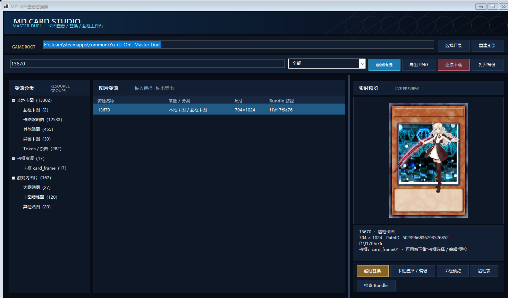

# MD 卡图查看替换器

用于查看、导出、替换《Yu-Gi-Oh! Master Duel》本体中已下载卡图资源的 Windows 工具。

## 下载与使用

在右侧 **Releases** 下载最新的分享 ZIP，解压后双击 `启动 MD卡图查看替换器.bat`。

[下载最新公开版本](https://github.com/noah-ad/MD-Card-Mod-Tool/releases/latest)

工具会自动定位游戏目录内的 `LocalData\\<用户哈希>\\0000` 与 `StreamingAssets\\AssetBundle`。分享包已经内置不含个人绝对路径的卡号预绑定索引，第一次启动会按对方的用户哈希自动重绑定并写入本地缓存，不再扫描数万个 Bundle；异画、Token 与杂图分类也已包含在索引中。

## 主要功能

- 本地卡图、游戏内图片与 704×1024 卡框的分类浏览、搜索、导入替换和 PNG 导出
- 内置 14,176 条可移植资源映射，包括 13,000+ 张 512×512 普通卡图、389 张 512×1024 灵摆卡图、卡框及游戏内图片；换电脑第一次打开也能直接读取
- 输入卡号时使用游戏原生逻辑路径 `Card/Images/Illust/tcg/<卡号>` 的 CRC32 直接定位 Bundle，不再遍历 LocalData；新版新增卡可按 Enter 或点击“定位卡图”补入本地缓存
- 拖入图片替换、拖出条目导出
- 替换图片后自动打开卡框实装裁剪器：直接叠加当前卡框查看最终效果，拖动构图，滚轮或滑杆可在 1%–2000% 内自由缩放，也可把整图缩到画框以内
- 自动备份，并可还原所选 Bundle
- 独立“我的 Mod”栏：自动汇总所有仍在生效的卡图改动，集中查看与还原
- 一键导出全部 Mod 为 `.mdmod.zip`，在另一台电脑导入时自动适配不同的 `LocalData\<用户哈希>` 路径并建立原版备份
- 超框卡图替换、单卡卡框选择/编辑和卡框预览；裁剪时卡框作为底层实时显示，任意尺寸原图都可构图为 704×1024，并保留透明通道
- 灵摆卡原生支持：识别游戏实际使用的 512×1024 完整卡图，单列“灵摆卡图”；工具按游戏真实 UV 取顶部 512×596 映射到卡框宽插图区，裁剪确认后再反向写入完整 512×1024 纹理，预览与替换使用完全相同的缩放规则
- 怪兽召唤动画替换：左侧“有怪兽动画”分类根据随包名单集中列出当前版本动画卡图；输入卡号可直接定位 SD 与 highend_hd 两套 Texture2D、Atlas、Spine JSON 共 6 个资源。打开工具生成的逐帧动画会直接播放当前游戏效果；拖入 GIF、MP4、WebM、MOV、MKV 等文件即可抽帧预览并一次写入两套动画。100% 对应完整 `4800×2700` 游戏画布，预览与写入使用相同的全画布比例
- 动画资源会与卡图一起纳入“我的 Mod”，支持一键导出、跨电脑导入和按卡号还原；写入失败时自动回滚全部 6 个 Bundle
- 异画卡筛选：仅百鸽未收录且编号处于 `20567–22747` 的资源归为异画；其他未收录资源归为 Token／杂图

## 界面预览



新版采用深海蓝、青色交互与金色超框提示的统一视觉体系，资源分类、列表、预览与操作区域拥有清晰的信息层级，并支持深色标题栏和高 DPI 缩放。

## 注意

替换和 Mod 导入都会直接写入游戏文件。首次修改每个 Bundle 前，工具会在游戏目录创建 `_MD卡图备份`。工具通过比较这份备份与当前文件建立轻量 Mod 台账，不会为了刷新“我的 Mod”重新扫描整个游戏。完成替换、导入或还原后，请完全退出并重启 Master Duel。

召唤动画功能只替换游戏中原本已经存在演出的卡，不能给本来没有召唤动画的卡新增演出。工具优先从首次备份恢复原始模板，并同时生成原卡拥有的全部动画名，例如 `animation`、`animation_USP` 或 `animation3`；因此额外的 AnimationReferenceAsset 仍能找到自己的时间轴，不会因只剩初始帧而卡住。动画画面占比默认 100%，以完整 16:9 游戏坐标 `4800×2700` 为基准，不再套用原怪兽骨骼边界；修改数值时左侧会在 16:9 游戏画布中实时缩放。工具可直接还原并播放由本工具写入的单槽逐帧动画；原版多骨骼／网格 Spine 演出只显示已定位状态，不会把拆散的关节图集冒充为完整预览。正式分享包包含独立的 FFmpeg 与 DirectXTex 工具；它们仅在本机完成视频抽帧和 BC3/DXT5 图集编码，不会上传视频。

## 源码构建

项目使用 .NET 8 WinForms。ImageSharp 通过 NuGet 自动还原；与现有 Bundle 写入逻辑兼容的 AssetsTools.NET 组件、Unity 类型数据库以及 DirectXTex `texconv.exe` 已随仓库提供。动画导入还需要把 `ffmpeg.exe` 放在系统 PATH，或放到发布目录的 `tools` 文件夹；GitHub 的完整分享包已经包含它。克隆后可执行：

```powershell
dotnet publish .\MdCardModTool\MdCardModTool.csproj -c Release -r win-x64 --self-contained true
```

维护者可在游戏资源更新后用 `--export-portable-index <游戏目录> <输出文件>` 重新生成 `prebuilt-index-v1.json.br`。导出过程会读取 `_MD卡图备份`，避免把维护者个人已经替换或超框后的尺寸写进公共索引。

本项目以 [MIT License](LICENSE) 开源。Master Duel、游戏资源与相关商标归其权利人所有，本仓库不包含游戏本体文件。

云盘下载渠道：[https://pan.quark.cn/s/a6bfde027547](https://pan.quark.cn/s/5d7137ad2cd7)
