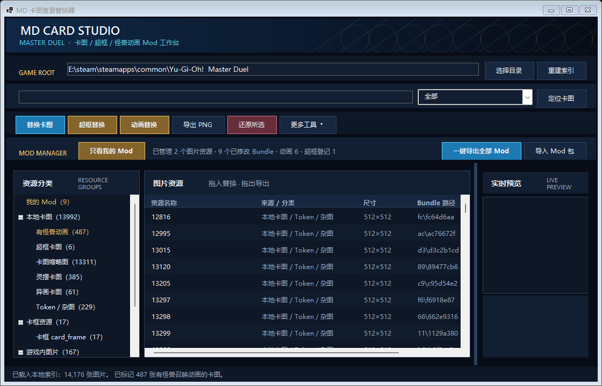

# MD 卡图查看替换器

用于查看、导出、替换《Yu-Gi-Oh! Master Duel》本体中已下载卡图资源的 Windows 工具。

## 下载与使用

在右侧 **Releases** 下载最新的分享 ZIP，解压后双击 `启动 MD卡图查看替换器.bat`。

[下载最新公开版本](https://github.com/noah-ad/MD-Card-Mod-Tool/releases/latest)

工具会自动定位游戏目录内的 `LocalData\\<用户哈希>\\0000` 与 `StreamingAssets\\AssetBundle`。分享包已经内置不含个人绝对路径的卡号预绑定索引，第一次启动会按对方的用户哈希自动重绑定并写入本地缓存，不再扫描数万个 Bundle；异画、Token 与杂图分类也已包含在索引中。

## 主要功能

- 本地卡图、游戏内图片与 704×1024 卡框的分类浏览、搜索、导入替换和 PNG 导出
- 内置 14,176 条可移植资源映射，包括 13,000+ 张 512×512 普通卡图、389 张 512×1024 灵摆卡图、卡框及游戏内图片；换电脑第一次打开也能直接读取
- “重建索引”会重新载入随包完整预绑定，并保留本机额外发现的新卡；不会再用按需下载且可能缺卡的 LocalData 扫描结果覆盖完整索引
- Master Duel 更新后会检测 `data.unity3d` 指纹，只重读其中 17 个 704×1024 卡框并按名称纠正新版 PathID；旧索引即使碰巧读到 128×128 的无关 UI 贴图，也不会再拖垮所有卡图预览
- 兼容外部工具手工制作的卡图 Mod：若 Bundle 中的 serialized file 或 PathID 与预绑定不同，预览、导出和拖出时会按卡号、贴图名及尺寸自动重新定位当前 Texture2D
- 写入外部 Mod 时兼容缺少 `m_StreamData` 的 inline Texture2D；应用卡框或再次替换前会重新定位真实 PathID，不再因空字段抛出 `Object reference` 异常
- 输入卡号时使用游戏原生逻辑路径 `Card/Images/Illust/tcg/<卡号>` 的 CRC32 直接定位 Bundle，不再遍历 LocalData；新版新增卡可按 Enter 或点击“定位卡图”补入本地缓存
- 拖入图片替换、拖出条目导出
- 替换图片后自动打开卡框实装裁剪器：直接叠加当前卡框查看最终效果，拖动构图，滚轮或滑杆可在 1%–2000% 内自由缩放，也可把整图缩到画框以内；超大手机照片会先生成 4096 边长的安全工作图，避免 GDI+ `OverflowException`
- 自动备份，并可还原所选 Bundle
- 独立“我的 Mod”栏：自动汇总所有仍在生效的卡图改动，集中查看与还原
- 一键导出全部 Mod 为 `.mdmod.zip`，在另一台电脑导入时自动适配不同的 `LocalData\<用户哈希>` 路径并建立原版备份
- 超框卡图替换、单卡卡框选择/编辑和卡框预览；裁剪时卡框作为底层实时显示，任意尺寸原图都可构图为 704×1024，并保留透明通道。工具会在 LocalData 的小型 Bundle 中定位游戏实际读取的 `of_card_asset` 并缓存新版哈希路径，不会误写 `data.unity3d` 的同名内置模板，也不会全盘解析 13 GB 资源；游戏更新重置登记后可从本地保存的透明原画与卡框设置一键恢复全部超框卡
- 灵摆卡原生支持：识别游戏实际使用的 512×1024 完整卡图，单列“灵摆卡图”；工具按游戏真实 UV 取顶部 512×596 映射到卡框宽插图区，裁剪确认后再反向写入完整 512×1024 纹理，预览与替换使用完全相同的缩放规则
- 怪兽召唤动画替换：左侧“有怪兽动画”分类根据随包名单集中列出当前版本动画卡图；输入卡号可直接定位 SD 与 highend_hd 两套主 Texture2D、Atlas、Spine JSON 共 6 个写入资源。除常规的比例子目录外，也会沿 Prefab 依赖定位 `ForUnity` 多页图集结构，因此火刀异画 `3899` 可以直接预览并替换；“重建动画映射”只重算当前卡，不再全盘扫描 LocalData。原版 Spine 4.x 会按骨骼、加权／非加权 mesh、deform、槽透明度与多页 Atlas 合成完整动画，不再显示拆散关节。输入另一张源卡号并点击“预览并使用”，可先预览源卡演出，再把它烘焙为透明逐帧动画安全写入当前目标卡。目标卡原本没有召唤动画时也无需先“借用”：直接拖入 GIF／视频，按钮会变成“创建并写入动画”，自动登记目标卡、克隆一套完全独立的动画模板并完成替换。默认“自动高清”会按帧数选择图集能容纳的最高单帧尺寸；可勾选“自动去绿幕”。100% 对应完整 `4800×2700` 游戏画布
- 自动去绿幕的基准色为 `#00FF00`（RGB `0,255,0`）。FFmpeg 参数为 `similarity=0.25`、`blend=0.08`，随后使用绿色 `despill mix=0.5` 抑制人物边缘绿光；因此接近纯绿的像素也会半透明或被移除，并非只匹配完全相同的色号
- 原始动画资源工作台：在“有怪兽动画”分类中双击卡图，或点击右侧“原始动画资源”，直接查看该卡 SD / HighEnd_HD 两套 PNG 图集、`.atlas` 与 Spine `.json`。支持文本/图片预览、逐文件导出与替换，以及整套导出后按映射批量导回，供熟悉 Spine 的用户自行制作；写入失败会整批回滚
- 动画资源会与卡图一起纳入“我的 Mod”，支持一键导出、跨电脑导入和按卡号还原；写入失败时自动回滚全部 6 个 Bundle
- 异画卡筛选：仅百鸽未收录且编号处于 `20567–22747` 的资源归为异画；其他未收录资源归为 Token／杂图
- 强制分类覆盖：`30000–30064` 归入“卡图缩略图”；`3401–3899`、`19736`、`20040` 归入“异画卡图”，优先级高于百鸽结果

## 界面预览



新版采用深海蓝、青色交互与金色超框提示的统一视觉体系。搜索、卡图替换、超框与动画替换集中在顶部主操作区，低频功能收进“更多工具”；裁剪器和动画窗口的确认按钮固定在底部，设置区可滚动。窗口使用 Per-Monitor V2 高 DPI 缩放，并会自动限制在当前屏幕工作区内，125%／150% 等系统缩放下也不会把关键按钮挤出画面。

## 注意

替换和 Mod 导入都会直接写入游戏文件。首次修改每个 Bundle 前，工具会在游戏目录创建 `_MD卡图备份`。工具通过比较这份备份与当前文件建立轻量 Mod 台账，不会为了刷新“我的 Mod”重新扫描整个游戏。完成替换、导入或还原后，请完全退出并重启 Master Duel。

已有原生演出的卡可以替换 GIF／视频，或把另一张卡的 Spine 烘焙成独立逐帧动画。没有原生演出的卡直接拖入素材即可：确认写入时，工具会在当前版 `CardIndividualData` 中登记目标卡，自动选择本机完整供体，并把 SD／HighEnd_HD 入口、Atlas、材质、贴图及其依赖克隆为目标卡专用资源，再同步更新 LocalData 的 `informations` 资源目录；写入失败会删除本次创建的整套资源并回滚登记。“高级：只读借用”仍保留给只想原样复用另一张卡演出的用户，但不是制作新动画的必经步骤。工具优先从首次备份恢复原始模板，并同时生成原卡拥有的全部动画名，例如 `animation`、`animation_USP` 或 `animation3`；因此额外的 AnimationReferenceAsset 仍能找到自己的时间轴，不会因只剩初始帧而卡住。对于 `ForUnity.png`、`ForUnity_2.png` 等原生多页图集，预览会读取全部页面；最终视频或跨卡动画替换只写入每套画质的主页面，并同步改写 Atlas 页名，其他旧页面保留但不再被新 JSON 引用。跨卡动画不是硬拷源 Bundle，而是把源卡 Spine 在本机渲染成透明帧，再沿用目标卡原有动画名生成新时间轴。动画画面占比默认 100%，以完整 16:9 游戏坐标 `4800×2700` 为基准；修改数值时左侧会实时缩放。自动高清按帧数与图集上限选择清晰度，并使用 DirectXTex 的高质量 BC3/DXT5 压缩。正式分享包包含独立的 FFmpeg 与 DirectXTex 工具；所有合成、抽帧和编码均在本机完成。

## 源码构建

项目使用 .NET 8 WinForms。ImageSharp 通过 NuGet 自动还原；与现有 Bundle 写入逻辑兼容的 AssetsTools.NET 组件、Unity 类型数据库以及 DirectXTex `texconv.exe` 已随仓库提供。动画导入还需要把 `ffmpeg.exe` 放在系统 PATH，或放到发布目录的 `tools` 文件夹；GitHub 的完整分享包已经包含它。克隆后可执行：

```powershell
dotnet publish .\MdCardModTool\MdCardModTool.csproj -c Release -r win-x64 --self-contained true
```

维护者可在游戏资源更新后用 `--export-portable-index <游戏目录> <输出文件>` 重新生成 `prebuilt-index-v1.json.br`。导出过程会读取 `_MD卡图备份`，避免把维护者个人已经替换或超框后的尺寸写进公共索引。

本项目以 [MIT License](LICENSE) 开源。Master Duel、游戏资源与相关商标归其权利人所有，本仓库不包含游戏本体文件。

